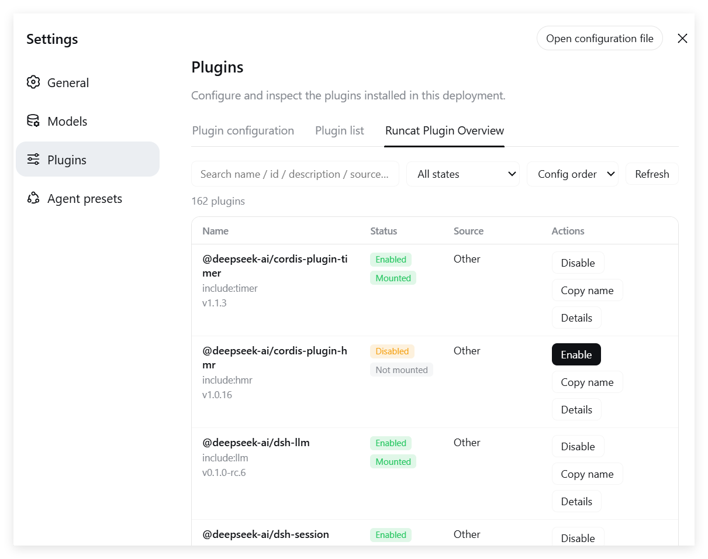

# dsh-plugin-runcat-inventory (Runcat Plugin Overview / 逃咪-插件总览)

[中文](README.md) | **English**

> Version: **v0.3.8** · Changelog: [CHANGELOG.en.md](CHANGELOG.en.md) ([中文](CHANGELOG.md))

A better DSH plugin list: **table view, status filters, enable/disable switches (hot-applied), config viewer and copy, automatic zh/en UI switching**.
Sits alongside the official "Plugin list" tab, registered at **Settings → Plugins → Runcat Plugin Overview** (shown as 逃咪-插件总览 in Chinese).

## Screenshot



## Features

| Capability | Description |
|---|---|
| Table view | 4 columns with fixed ratios: **Name 36% / Status 15% / Source 21% / Actions 28%** (name takes the largest share) |
| Languages | Built-in Simplified Chinese / English; the UI follows the DSH environment (Settings → General → Language, or the browser language); the plugin's own description switches too |
| Runtime status | Enabled/Disabled + Cordis status (Mounted / Waiting for deps / Loading / Mount failed / Not mounted / Unloading) |
| Description / Version | Read from each package's `package.json`; the full description is shown in the expanded row (click "Details") |
| Source | Only this plugin shows its repository home page (https://github.com/runcat-tommy/dsh-plugin-runcat-inventory); others show the install method (local link / local path / GitHub / npm / built-in) |
| Details expansion | The "Details" button appears when a plugin has a description or a config; the expanded row shows the full description + config JSON, with one-click copy |
| Enable / Disable | Edits the profile's `cordis.patch.yml` (user override layer), **hot-applied via HMR — no restart needed** |
| Search & filter | Keyword (combined search over name / id / description / source / version) + status filter |
| Sorting | Config order (default) / Name ↑ / Name ↓ |
| Width | No sticky columns; ←/→ arrow keys scroll horizontally; the Source column hides on narrow screens |

## Structure

```
dsh-plugin-runcat-inventory/   # local folder name after git clone (same as the repo)
├── package.json      # dsh.bundle.patch + dsh.client declarations
├── cordis.patch.yml  # patch layer: inserts this plugin entry into the root entry list
├── lib/
│   ├── index.js      # Host half: loader inventory + /runcat-api routes + patch file editing
│   └── client.js     # Browser half: hand-written ModuleLoader bundle, table UI
├── test/
│   └── mock-test.mjs # host-half unit tests (node test/mock-test.mjs, 5 cases)
├── assets/
│   ├── preview-zh.png # Chinese-UI screenshot
│   └── preview-en.png # English-UI screenshot
├── CHANGELOG.md      # changelog (Chinese)
├── CHANGELOG.en.md   # changelog (English)
├── README.md         # Chinese docs
└── README.en.md      # English docs (this file)
```

## Prerequisites

| Dependency | Required? | Notes |
|---|---|---|
| **Node.js** | ✅ Required | DSH itself is a Node program; install Node.js (suggest 20+ or the latest LTS; no strict minimum) |
| **DSH CLI** | ✅ Required | `npm i -g @deepseek-ai/dsh` |
| **pnpm** | ✅ Required | `dsh plugin` forwards to pnpm; without it you get `pnpm not found on PATH`; install with `npm i -g pnpm` |
| **Git** | ⚠️ Depends on method | Needed for Method B (GitHub source) or Method C (local development); not needed for Method A (npm) |
| **Network** | ⚠️ Depends on environment | Method A needs access to the npm registry; Methods B/C need access to GitHub — if direct connections fail, configure a git proxy, e.g. `git config --global http.https://github.com.proxy http://127.0.0.1:7897` |

> This plugin itself has **zero dependencies**: the host half only uses Node built-ins (plus lazily resolving js-yaml from the profile), and the browser half is a hand-written ModuleLoader bundle. Nothing extra to install.

## Installation

Installs into the `web` profile (replace `web` with your profile name if different).

### Method A: npm install (simplest, recommended)

```sh
dsh plugin --profile web add dsh-plugin-runcat-inventory
```

> Pulls directly from the npm registry; the package is published at
> https://www.npmjs.com/package/dsh-plugin-runcat-inventory
> (if your npm/pnpm is configured with a mirror, wait for the mirror to sync).

### Method B: install directly from GitHub

```sh
dsh plugin --profile web add github:runcat-tommy/dsh-plugin-runcat-inventory
```

> pnpm pulls the repo directly from GitHub; this plugin has no build scripts, so no `allowBuilds` is needed.

### Method C: local folder (for development/debugging)

```sh
git clone https://github.com/runcat-tommy/dsh-plugin-runcat-inventory.git
cd dsh-plugin-runcat-inventory
dsh plugin --profile web add .
```

> `dsh plugin add .` links this folder into the profile via `link:` — dev-friendly: code changes take effect after restarting the Web UI, no reinstall needed.

### Verify

`dsh --profile web --dump-config` should end with an entry whose **id is `runcat-inventory` and name is `dsh-plugin-runcat-inventory`**.
Then **restart the Web UI** and open **Settings → Plugins → Runcat Plugin Overview** (逃咪-插件总览 in Chinese).

## How it works

- **Data**: the host half iterates `ctx.loader.entries()` (same as the official inventory); fiber status maps from FiberState; description/version are read from each package's `package.json`; source is derived from the profile's `package.json` dependency declarations.
- **Enable/Disable**: writes `{id, name, disabled: true}` patches into `~/.dsh/profiles/web/cordis.patch.yml` (to disable) or removes them (to enable). DSH watches this file via HMR (`watchUserPatches`) and hot-applies changes to the loader — plugins toggle instantly without a restart.
- **Communication**: the browser half fetches same-origin `/runcat-api` routes; routes carry a loopback trust check (CSRF protection).
- **Lazy js-yaml resolution**: when installed via `link:`, the plugin's real path is the workspace (no node_modules there), so at runtime js-yaml is resolved anchored at the profile directory.

## Uninstall

```sh
dsh plugin --profile web remove dsh-plugin-runcat-inventory
```

## Known limitations

- If `cordis.patch.yml` contains `!!js` expressions, the enable/disable switch reports a failure (the file is never corrupted; it just cannot be auto-edited).
- The disable patch is matched and removed exactly as `{id, name, disabled: true}` (three keys); conflicts with hand-written content are resolved by the "exactly three keys" rule.

## Changelog

Full history in [CHANGELOG.en.md](CHANGELOG.en.md) ([中文](CHANGELOG.md)).

- **v0.3.8** (2026-08-27): installation gained "Method A: npm install" (simplest, recommended); the previous methods became B/C; `package.json` gained a `dsh.marketplace` declaration (for the dsh-plugin-marketplace scanner).
- **v0.3.7** (2026-08-27): added preview screenshots — the Chinese README shows the Chinese-UI screenshot, the English README shows the English-UI screenshot (`assets/` folder).
- **v0.3.6** (2026-08-27): docs — added `CHANGELOG.en.md` (English changelog) with language switcher links on both changelogs.
- **v0.3.5** (2026-08-27): docs — added Method B (install from GitHub source); added `README.en.md` (English docs) with language switcher links on both READMEs.
- **v0.3.4** (2026-08-27): docs — folder name unified to `dsh-plugin-runcat-inventory`; added the "Prerequisites" section.
- **v0.3.3** (2026-08-27): the plugin's own description now follows the UI language (zh/en, in the Details row).
- **v0.3.2** (2026-08-27): fix — only this plugin shows the repo URL; others show install methods again; Source column content wraps (long URLs no longer overflow into Actions).
- **v0.3.1** (2026-08-27): fixed column ratios (Name 36% / Status 15% / Source 21% / Actions 28%); Source shows the repo URL for this plugin.
- **v0.3.0** (2026-08-27): i18n — zh/en dictionaries via the DSH locale service; host errors become error codes; source becomes kind+spec.
- **v0.2.1** (2026-08-27): Chinese name changed from 逃猫-插件总览 to 逃咪-插件总览.
- **v0.2.0** (2026-08-27): 4-column layout, details expansion, name sorting, keyboard scrolling, narrow-screen adaptation; two cross-platform bug fixes; mock unit tests.
- **v0.1.0** (2026-08-27): initial release — 7-column table, enable/disable (HMR hot-applied), config viewer/copy, search filters.
