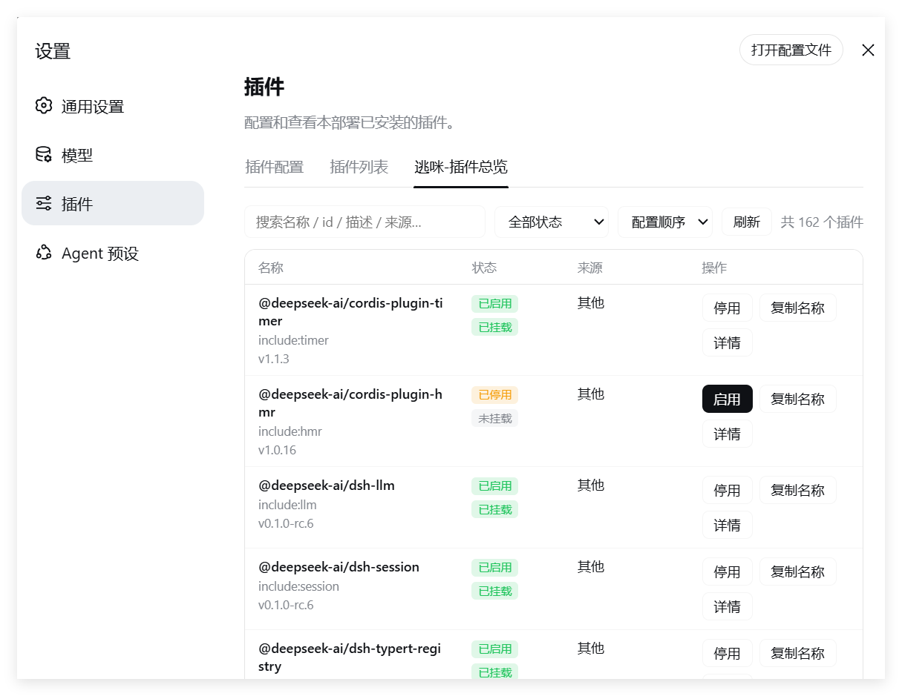

# dsh-plugin-runcat-inventory（逃咪-插件总览）

**中文** | [English](README.en.md)

> 版本：**v0.3.7** · 更新记录见 [CHANGELOG.md](CHANGELOG.md)（[English](CHANGELOG.en.md)）

一个更好用的 DSH 插件列表：**表格视图、状态过滤、启用/停用开关（热生效）、配置查看与复制、中英文界面自动切换**。
与官方"插件列表"并存，注册在 设置 → 插件 → 逃咪-插件总览（英文环境显示 Runcat Plugin Overview）。

## 效果预览



## 功能

| 能力 | 说明 |
|---|---|
| 表格视图 | 4 列固定比例：名称 36% / 状态 15% / 来源 21% / 操作 28%（名称占最多） |
| 多语言 | 内置简体中文 / English 双语，界面语言跟随 DSH 环境（设置 → 通用 → Language / 浏览器语言）自动切换；本插件自身的描述也随语言切换 |
| 运行状态 | 已启用/已停用 + Cordis 状态（已挂载 / 等待依赖 / 加载中 / 挂载失败 / 未挂载 / 卸载中） |
| 描述 / 版本 | 从各包 `package.json` 读取；描述全文在展开行内查看（点"详情"） |
| 来源 | 仅本插件显示仓库主页地址（https://github.com/runcat-tommy/dsh-plugin-runcat-inventory）；其余插件按安装方式显示（本地链接 / 本地路径 / GitHub / npm / 内置） |
| 详情展开 | 有描述或有配置才显示"详情"按钮；展开后行内查看描述全文 + 配置 JSON，配置可一键复制 |
| 启用 / 停用 | 编辑 profile 的 `cordis.patch.yml`（用户覆盖层），**HMR 热生效，无需重启** |
| 搜索过滤 | 关键字（联合搜索名称/id/描述/来源/版本）+ 状态筛选 |
| 排序 | 配置顺序（默认）/ 名称 ↑ / 名称 ↓ |
| 宽度优化 | 无粘性固定列；键盘 ←/→ 横向滚动；窄屏自动隐藏"来源"列 |

## 结构

```
dsh-plugin-runcat-inventory/   # git clone 后的本地文件夹名（与仓库同名）
├── package.json      # dsh.bundle.patch + dsh.client 声明
├── cordis.patch.yml  # 补丁层：把本插件条目 insert 进根 entry 列表
├── lib/
│   ├── index.js      # Host 半端：loader 清单 + /runcat-api 路由 + patch 文件编辑
│   └── client.js     # 浏览器半端：ModuleLoader bundle，表格 UI
├── test/
│   └── mock-test.mjs # host 半端单元测试（node test/mock-test.mjs，5 用例）
├── assets/
│   ├── preview-zh.png # 中文界面效果图
│   └── preview-en.png # 英文界面效果图
├── CHANGELOG.md      # 更新记录（中文）
├── CHANGELOG.en.md   # 更新记录（英文）
├── README.md         # 中文说明
└── README.en.md      # 英文说明
```

## 前置条件

| 依赖 | 必需？ | 说明 |
|---|---|---|
| **Node.js** | ✅ 必需 | DSH 本身是 Node 程序，必须安装 Node.js（建议 20+ 或最新 LTS，无严格版本下限要求） |
| **DSH CLI** | ✅ 必需 | `npm i -g @deepseek-ai/dsh` |
| **pnpm** | ✅ 必需 | `dsh plugin` 命令是 pnpm 的转发器，未安装会报 `pnpm not found on PATH`；`npm i -g pnpm` |
| **Git** | ⚠️ 视安装方式 | 从 GitHub 克隆仓库、或直接 `dsh plugin add github:runcat-tommy/dsh-plugin-runcat-inventory` 时需要；仅用本地文件夹安装则不需要 |
| **网络** | ⚠️ 视环境 | 需要能访问 GitHub；直连不通时可为 git 配置代理，如 `git config --global http.https://github.com.proxy http://127.0.0.1:7897` |

> 本插件自身**零依赖**：host 半端只用 Node 内置模块（外加惰性解析 profile
> 里的 js-yaml），浏览器半端手写 ModuleLoader bundle，无需额外安装任何包。

## 安装

装进 web profile（如果用的是其他 profile，把 `web` 换成实际名字）。

### 方法 A：本地目录安装（开发/调试推荐）

```sh
git clone https://github.com/runcat-tommy/dsh-plugin-runcat-inventory.git
cd dsh-plugin-runcat-inventory
dsh plugin --profile web add .
```

> `dsh plugin add .` 会把本目录以 `link:` 方式装进 profile——本地开发
> 友好：改代码后重启 Web UI 即生效，无需重复安装。

### 方法 B：GitHub 源直接安装

```sh
dsh plugin --profile web add github:runcat-tommy/dsh-plugin-runcat-inventory
```

> pnpm 直接从 GitHub 拉取；本插件无构建脚本，无需配置 allowBuilds。

### 验证

`dsh --profile web --dump-config` 末尾应出现条目——**id 为
`runcat-inventory`、name 为 `dsh-plugin-runcat-inventory`**。
然后**重启 Web UI**，进入 设置 → 插件 → 逃咪-插件总览（英文环境显示
Runcat Plugin Overview）。

## 工作原理

- **数据**：Host 端遍历 `ctx.loader.entries()`（与官方 inventory 相同），
  fiber 状态映射自 FiberState；描述/版本读各包 package.json；来源读
  profile 的 `package.json` 依赖声明。
- **启用/停用**：向 `~/.dsh/profiles/web/cordis.patch.yml` 写入
  `{id, name, disabled: true}` 补丁（停用）或移除该补丁（启用）。
  该文件被 DSH 通过 HMR 监听（`watchUserPatches`），改动自动热应用到
  loader —— 插件立即停用/启用，无需重启。
- **通信**：浏览器半端同源 fetch → `/runcat-api` 路由；路由带 loopback
  信任校验（防远程网站 CSRF）。
- **js-yaml 惰性解析**：插件以 link: 安装时真实路径在工作区（无
  node_modules），因此运行时锚定 profile 目录解析 js-yaml。

## 卸载

```sh
dsh plugin --profile web remove dsh-plugin-runcat-inventory
```

## 已知限制

- 若 `cordis.patch.yml` 含 `!!js` 表达式，启用/停用开关会提示失败（不
  会破坏文件，仅无法自动编辑）。
- 停用补丁按 `{id, name, disabled: true}` 精确匹配移除；与用户手写内容
  冲突时以"恰好三个键"为准。

## 更新记录

完整变更历史见 [CHANGELOG.md](CHANGELOG.md)（[English](CHANGELOG.en.md)）。

- **v0.3.7**（2026-08-27）：新增效果预览图——中文 README 展示中文界面截图，
  英文 README 展示英文界面截图（`assets/` 目录）。
- **v0.3.6**（2026-08-27）：文档——新增英文版更新记录
  `CHANGELOG.en.md`，两份 CHANGELOG 互加语言切换链接。
- **v0.3.5**（2026-08-27）：文档——安装新增"方法 B：GitHub 源直接安装"；
  新增英文说明 `README.en.md`，中英文文档顶部互加语言切换链接。
- **v0.3.4**（2026-08-27）：文档更新——使用说明的文件夹名统一为
  `dsh-plugin-runcat-inventory`（与 GitHub 仓库名一致）；新增"前置条件"
  章节（Node.js / DSH / pnpm / Git / 网络）。
- **v0.3.3**（2026-08-27）：本插件自身的描述随界面语言切换——中文环境
  显示中文描述，英文环境显示英文描述（"详情"展开行的 Description 内容）。
- **v0.3.2**（2026-08-27）：修复——仅本插件显示仓库地址，其余插件恢复按
  安装方式显示来源；来源列内容加断行保护（`word-break: break-all`），
  长 URL 不再溢出到"操作"列。
- **v0.3.1**（2026-08-27）：列宽改为固定比例（名称 36% / 状态 15% /
  来源 21% / 操作 28%）；来源优先显示仓库地址（package.json 的
  `repository`），本插件显示 https://github.com/runcat-tommy/dsh-plugin-runcat-inventory。
- **v0.3.0**（2026-08-27）：**国际化**——注册 zh/en 双语字典，全部界面文案
  走 DSH locale 服务，随环境语言自动切换（英文选项卡名 Runcat Plugin
  Overview）；host 错误改为错误码、来源改为 kind+spec，由客户端翻译。
- **v0.2.1**（2026-08-27）：插件中文名由"逃猫-插件总览"改为"逃咪-插件总览"。
- **v0.2.0**（2026-08-27）：表格改为固定 4 列并移除粘性列；"详情"按钮
  按"有描述或有配置"显示；新增名称排序、键盘 ←/→ 横向滚动、窄屏隐藏
  "来源"列；修复两处跨平台 bug；新增 mock 单元测试。
- **v0.1.0**（2026-08-27）：初始版本，7 列表格 + 启用/停用（HMR 热生效）
  + 配置查看/复制 + 搜索过滤。
